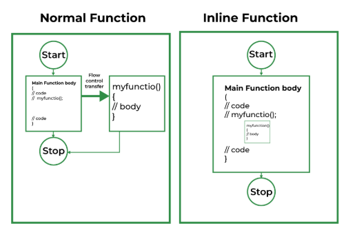

# C++ OOP Best Practices

## 1. Naming Conventions

### Classes & Structs
- Use **PascalCase** for class and struct names.
```cpp
class Animal;
struct Point3D;
```

### Variables & Member Variables
- Use **camelCase** for variables.
```cpp
int numberOfDonuts;
std::string favePhrase;
```

### Functions & Methods
- Use **camelCase** for function names.
- Use verbs for functions that perform actions.
```cpp
void moveForward();
bool isAlive() const;
```

### Constants & Macros
- Use **UPPER_CASE_SNAKE_CASE** for constants and macros.
```cpp
const double PI = 3.14159;
#define MAX_SPEED 200
```


## 2. Code Readability & Clean Code

### Keep Functions Small
- Follow **Single Responsibility Principle**. A function should do a single thing.
```cpp
void calculateTax();
void printInvoice();
```

### Avoid Magic Numbers
```cpp
const int MaxRetries = 3;
```


## 3. C++ Memory Alignment & Struct Packing Best Practices

### Why Memory Alignment Matters
Properly ordering class/struct members reduces **padding** and improves memory efficiency. The compiler aligns data members to optimize CPU access, but poor ordering can lead to **wasted space**.

---
- Each data type has an **alignment requirement** (e.g., `int` = 4 bytes, `double` = 8 bytes).
- If a member is misaligned, the compiler inserts **padding bytes**.

### 🚨 Bad Example (Misaligned)
```cpp
struct Bad {
    char a;    // 1 byte
    int b;     // 4 bytes (needs 3 bytes padding after 'a')
    double c;  // 8 bytes (int only takes 4, needs 4 bytes padding)
};
```
🔴 **Total size = 1 + 3 (padding) + 4 + 4 (padding) + 8 = 24 bytes**


- **Sort members from largest to smallest** to minimize padding.

### ✅ Good Example (Optimized)
```cpp
struct Good {
    double c;  // 8 bytes
    int b;     // 4 bytes
    char a;    // 1 byte (fits within previous 4-byte space)
};
```
🟢 **Total size = 8 + 4 + 1 = 16 bytes (no wasted space!)**

## 4. Inline Methods in C++: When to Use and Avoid

### What Are Inline Methods?
Inline functions are expanded **at the call site** instead of performing a function call. This can **reduce function call overhead** but **increase code size** (code bloat).

### Declaring an Inline Function
```cpp
inline void sayHello() {
    std::cout << "Hello!" << std::endl;
}
```

### OR inside a class definition (implicitly inline):
```cpp
class Greeter {
public:
    void sayHello(); // Method declaration
    void greetFormally(); // Another method
};

// Method definition outside the class (not inline)
void Greeter::sayHello() {
    std::cout << "Hello!" << std::endl;
}
```




---
### ✅ When to Use Inline Methods
✔ **Short, frequently used functions** (like getters, setters, and simple utility functions):
```cpp
class Person {
public:
    inline int getAge() const { return age; }
private:
    int age;
};
```

❌ When to Avoid Inline Methods
❌ **Large functions**: Causes **code bloat** and increased **cache misses**.
```cpp
inline void processData(std::vector<int>& data) {  // ⚠️ Bad idea
    for (int& d : data) { d *= 2; }
}
```
❌ **Functions that change frequently**: Code changes in the header require **recompiling all dependent files**.  
❌ **Virtual functions**: They rely on **dynamic dispatch** and cannot be inlined.
